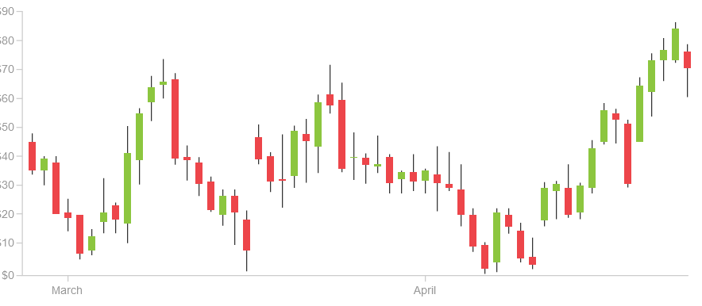

# Stocks Exchange Manager

Welcome to our Stocks Exchange Manager, a platform for traders to buy and sell stocks, manage portfolios, and analyze market data in a simulated stock exchange environment.

## Installation

Go to and run "src/main/java/App/HelloApplication.java"
    
## Features

### Trader Features
- Buying and selling stocks.
- Managing portfolio.
- Analyzing market data through candlestick charts and line charts.
- Exporting stock history to CSV files
- Subscribe for notifications on stock price changes (*premium feature*)
- Show line charts for specific stocks (*premium feature*)

### Admin Features
- Publish Company stocks in market.
- Validate cash deposits and withdrawls for users.
- Initiate and close trading sessions.
- Listing stock orders filtered by the stock label.

### Company Features
- Publishing its stocks in the market
## UML sequence diagrams
### Candlestick graphing UML sequence diagram

### Orders approval system UML sequence diagram

## UML class diagram
## Stock Performance Analysis Tools

We offer two main graphing tools for stock Performance visualization; Candlestick graph and Line Chart

### Candlestick Chart

### Line Chart

